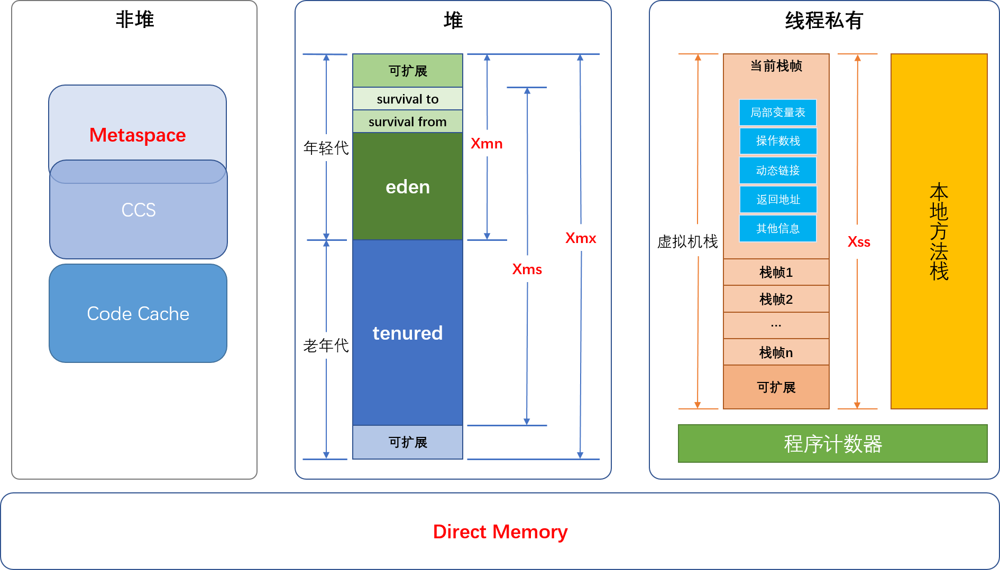
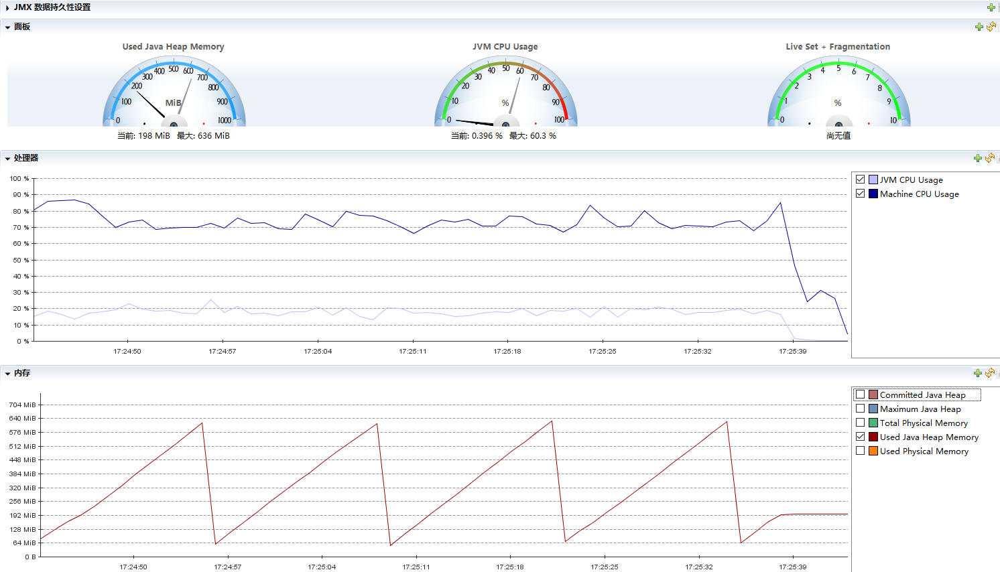

# Week01 作业题目（周三）
## 3. 内存参数的关系


## 4. 业务系统分析
1. 数据采集时间为服务启动后2天左右.
2. jdk1.8, jinfo拿到的配置信息如下
	1. -XX:CICompilerCount=3 
	2. -XX:InitialHeapSize=130023424, 即Xms, 即初始堆空间, 124MB
	3. -XX:MaxHeapSize=2065694720, 即Xmx, 最大堆空间, 1970MB
	4. -XX:MaxNewSize=688390144, 即Xmn, 最大新生代空间, 656MB, 最大堆空间的1/3
	5. -XX:MinHeapDeltaBytes=524288
	6. -XX:NewSize=42991616, 初始新生代空间, 41MB
	7. -XX:OldSize=87031808, 初始老年代空间, 83MB
	8. -XX:+UseCompressedClassPointers, 使用压缩指针
	9. -XX:+UseCompressedOops
	10. -XX:+UseParallelGC, gc
3. 服务器规格4U8G.

### 4.1 jstat
#### 4.1.1 数据说明
1. 参数是每秒打点.
2. -gc表头说明
	1. C后缀就是容量空间, U后缀就是使用空间. 
	2. 体积单位是KB, 耗时单位是秒.
	3. SO-Survival0, S1-Survival1, E-Eden, O-Old, M-Metaspace, CCS-Compressed class space
	4. YGC-young gc次数, YGCT-young gc总耗时, FGC-full gc次数, FGCT-full gc总耗时, GCT-所有gc总耗时.
3. -gcutil说明
	1. 打印的都是百分比
	2. 各区域缩写见-gc表头说明

#### 4.1.2 数据分析
1. 2天时间进行4800次young gc, 每小时100次, 每次耗时12ms.
2. 2天时间进行9次full gc, 每次耗时333ms. 频率和耗时都尚可.
	- 平均500多次young gc发生一次full gc.
3. Eden区容量60MB左右, Survival区容量4-6MB, 年轻代容量为69MB左右.
	- 最大年轻代空间为656MB, 可见还有较多富余.
4. 老年代容量480MB左右.
	- 最大老年代空间为1970MB-656MB, 1313MB, 可见还有较多富余.
5. Metaspace容量170MB左右.
6. Compressed class space容量160MB左右.
7. 机器是4U8G, 空间没有很好地利用起来.
	- 可以将Xmx设置为8G的75%, 即6G左右.
	- 当业务量不多时, 根据adaptive自适应属性, 堆空间并不会很大.
	- 当突发大业务量时, 6G堆内存用ParallelGC, STW时间可能会很长, 可以尝试使用G1.

#### 4.1.3 原始数据
```
jstat -gc 21974 1000 1000
 S0C    S1C    S0U    S1U      EC       EU        OC         OU       MC     MU    CCSC   CCSU   YGC     YGCT    FGC    FGCT     GCT   
5632.0 5120.0  0.0   4786.4 60416.0  18313.8   488960.0   333784.6  170712.0 162292.7 18944.0 17564.2   4707   59.039   9      2.997   62.036
5632.0 5120.0  0.0   4786.4 60416.0  22502.2   488960.0   333784.6  170712.0 162292.7 18944.0 17564.2   4707   59.039   9      2.997   62.036
5632.0 5120.0  0.0   4786.4 60416.0  26172.6   488960.0   333784.6  170712.0 162292.7 18944.0 17564.2   4707   59.039   9      2.997   62.036
5632.0 5120.0  0.0   4786.4 60416.0  32908.8   488960.0   333784.6  170712.0 162292.7 18944.0 17564.2   4707   59.039   9      2.997   62.036
5632.0 5120.0  0.0   4786.4 60416.0  41887.6   488960.0   333784.6  170712.0 162292.7 18944.0 17564.2   4707   59.039   9      2.997   62.036
5632.0 5120.0  0.0   4786.4 60416.0  49664.9   488960.0   333784.6  170712.0 162292.7 18944.0 17564.2   4707   59.039   9      2.997   62.036
5632.0 5120.0  0.0   4786.4 60416.0  57383.3   488960.0   333784.6  170712.0 162292.7 18944.0 17564.2   4707   59.039   9      2.997   62.036
5632.0 5632.0 4705.1  0.0   60416.0   6054.9   488960.0   333824.4  170712.0 162292.7 18944.0 17564.2   4708   59.049   9      2.997   62.046
5632.0 5632.0 4705.1  0.0   60416.0   8501.2   488960.0   333824.4  170712.0 162292.7 18944.0 17564.2   4708   59.049   9      2.997   62.046
5632.0 5632.0 4705.1  0.0   60416.0  15943.7   488960.0   333824.4  170712.0 162292.7 18944.0 17564.2   4708   59.049   9      2.997   62.046
5632.0 5632.0 4705.1  0.0   60416.0  17430.0   488960.0   333824.4  170712.0 162292.7 18944.0 17564.2   4708   59.049   9      2.997   62.046
5632.0 5632.0 4705.1  0.0   60416.0  28738.1   488960.0   333824.4  170712.0 162292.7 18944.0 17564.2   4708   59.049   9      2.997   62.046
5632.0 5632.0 4705.1  0.0   60416.0  34629.8   488960.0   333824.4  170712.0 162292.7 18944.0 17564.2   4708   59.049   9      2.997   62.046
5632.0 5632.0 4705.1  0.0   60416.0  39173.3   488960.0   333824.4  170712.0 162292.7 18944.0 17564.2   4708   59.049   9      2.997   62.046
5632.0 5632.0 4705.1  0.0   60416.0  44262.4   488960.0   333824.4  170712.0 162292.7 18944.0 17564.2   4708   59.049   9      2.997   62.046
5632.0 5632.0 4705.1  0.0   60416.0  58121.2   488960.0   333824.4  170712.0 162292.7 18944.0 17564.2   4708   59.049   9      2.997   62.046
5632.0 5632.0  0.0   4721.7 60416.0  12564.7   488960.0   333874.8  170712.0 162292.7 18944.0 17564.2   4709   59.058   9      2.997   62.055
5632.0 5632.0  0.0   4721.7 60416.0  24536.1   488960.0   333874.8  170712.0 162292.7 18944.0 17564.2   4709   59.058   9      2.997   62.055
5632.0 5632.0  0.0   4721.7 60416.0  30419.2   488960.0   333874.8  170712.0 162292.7 18944.0 17564.2   4709   59.058   9      2.997   62.055
5632.0 5632.0  0.0   4721.7 60416.0  33348.1   488960.0   333874.8  170712.0 162292.7 18944.0 17564.2   4709   59.058   9      2.997   62.055
5632.0 5632.0  0.0   4721.7 60416.0  36203.9   488960.0   333874.8  170712.0 162292.7 18944.0 17564.2   4709   59.058   9      2.997   62.055
5632.0 5632.0  0.0   4721.7 60416.0  45616.4   488960.0   333874.8  170712.0 162292.7 18944.0 17564.2   4709   59.058   9      2.997   62.055
5632.0 5632.0  0.0   4721.7 60416.0  48461.7   488960.0   333874.8  170712.0 162292.7 18944.0 17564.2   4709   59.058   9      2.997   62.055
5632.0 5632.0  0.0   4721.7 60416.0  54862.3   488960.0   333874.8  170712.0 162292.7 18944.0 17564.2   4709   59.058   9      2.997   62.055
5632.0 5632.0  0.0   4721.7 60416.0  58081.8   488960.0   333874.8  170712.0 162292.7 18944.0 17564.2   4709   59.058   9      2.997   62.055
5632.0 5632.0 4400.6  0.0   60416.0   6359.3   488960.0   333925.2  170712.0 162292.7 18944.0 17564.2   4710   59.068   9      2.997   62.065
5632.0 5632.0 4400.6  0.0   60416.0  13933.2   488960.0   333925.2  170712.0 162292.7 18944.0 17564.2   4710   59.068   9      2.997   62.065
5632.0 5632.0 4400.6  0.0   60416.0  21804.2   488960.0   333925.2  170712.0 162292.7 18944.0 17564.2   4710   59.068   9      2.997   62.065
5632.0 5632.0 4400.6  0.0   60416.0  23479.2   488960.0   333925.2  170712.0 162292.7 18944.0 17564.2   4710   59.068   9      2.997   62.065
5632.0 5632.0 4400.6  0.0   60416.0  31194.7   488960.0   333925.2  170712.0 162292.7 18944.0 17564.2   4710   59.068   9      2.997   62.065
5632.0 5632.0 4400.6  0.0   60416.0  39276.2   488960.0   333925.2  170712.0 162292.7 18944.0 17564.2   4710   59.068   9      2.997   62.065
5632.0 5632.0 4400.6  0.0   60416.0  43677.8   488960.0   333925.2  170712.0 162292.7 18944.0 17564.2   4710   59.068   9      2.997   62.065
5632.0 5632.0 4400.6  0.0   60416.0  52929.0   488960.0   333925.2  170712.0 162292.7 18944.0 17564.2   4710   59.068   9      2.997   62.065
5632.0 5632.0  0.0   4688.6 60416.0   5581.0   488960.0   333983.7  170712.0 162292.7 18944.0 17564.2   4711   59.077   9      2.997   62.074
5632.0 5632.0  0.0   4688.6 60416.0  11156.5   488960.0   333983.7  170712.0 162292.7 18944.0 17564.2   4711   59.077   9      2.997   62.074
5632.0 5632.0  0.0   4688.6 60416.0  16240.9   488960.0   333983.7  170712.0 162292.7 18944.0 17564.2   4711   59.077   9      2.997   62.074
5632.0 5632.0  0.0   4688.6 60416.0  20963.2   488960.0   333983.7  170712.0 162292.7 18944.0 17564.2   4711   59.077   9      2.997   62.074
5632.0 5632.0  0.0   4688.6 60416.0  38683.5   488960.0   333983.7  170712.0 162292.7 18944.0 17564.2   4711   59.077   9      2.997   62.074
5632.0 5632.0  0.0   4688.6 60416.0  47175.7   488960.0   333983.7  170712.0 162292.7 18944.0 17564.2   4711   59.077   9      2.997   62.074
5632.0 5632.0  0.0   4688.6 60416.0  51676.8   488960.0   333983.7  170712.0 162292.7 18944.0 17564.2   4711   59.077   9      2.997   62.074
5632.0 5632.0 4864.6  0.0   60416.0   6781.9   488960.0   334052.6  170712.0 162292.7 18944.0 17564.2   4712   59.087   9      2.997   62.084
5632.0 5632.0 4864.6  0.0   60416.0  23121.1   488960.0   334052.6  170712.0 162292.7 18944.0 17564.2   4712   59.087   9      2.997   62.084
5632.0 5632.0 4864.6  0.0   60416.0  34162.9   488960.0   334052.6  170712.0 162292.7 18944.0 17564.2   4712   59.087   9      2.997   62.084
5632.0 5632.0 4864.6  0.0   60416.0  47873.5   488960.0   334052.6  170712.0 162292.7 18944.0 17564.2   4712   59.087   9      2.997   62.084
5632.0 5632.0 4864.6  0.0   60416.0  59630.9   488960.0   334052.6  170712.0 162292.7 18944.0 17564.2   4712   59.087   9      2.997   62.084
5632.0 5632.0  0.0   4785.1 60416.0   3879.8   488960.0   334118.9  170712.0 162292.7 18944.0 17564.2   4713   59.097   9      2.997   62.094
5632.0 5632.0  0.0   4785.1 60416.0   7460.0   488960.0   334118.9  170712.0 162292.7 18944.0 17564.2   4713   59.097   9      2.997   62.094
5632.0 5632.0  0.0   4785.1 60416.0  10995.6   488960.0   334118.9  170712.0 162292.7 18944.0 17564.2   4713   59.097   9      2.997   62.094
5632.0 5632.0 5182.3  0.0   60416.0   446.3    488960.0   334195.8  170712.0 162292.7 18944.0 17564.2   4714   59.109   9      2.997   62.106
5632.0 5632.0 5182.3  0.0   60416.0  52993.5   488960.0   334195.8  170712.0 162292.7 18944.0 17564.2   4714   59.109   9      2.997   62.106
5632.0 5632.0  0.0   5205.6 60416.0    11.5    488960.0   334272.8  170712.0 162292.7 18944.0 17564.2   4715   59.119   9      2.997   62.116
5632.0 5632.0  0.0   5205.6 60416.0  12151.2   488960.0   334272.8  170712.0 162292.7 18944.0 17564.2   4715   59.119   9      2.997   62.116
5632.0 5632.0  0.0   5205.6 60416.0  23489.0   488960.0   334272.8  170712.0 162292.7 18944.0 17564.2   4715   59.119   9      2.997   62.116
5632.0 5632.0  0.0   5205.6 60416.0  27444.8   488960.0   334272.8  170712.0 162292.7 18944.0 17564.2   4715   59.119   9      2.997   62.116
5632.0 5632.0  0.0   5205.6 60416.0  30213.4   488960.0   334272.8  170712.0 162292.7 18944.0 17564.2   4715   59.119   9      2.997   62.116
5632.0 5632.0  0.0   5205.6 60416.0  40788.9   488960.0   334272.8  170712.0 162292.7 18944.0 17564.2   4715   59.119   9      2.997   62.116
5632.0 5632.0  0.0   5205.6 60416.0  47201.8   488960.0   334272.8  170712.0 162292.7 18944.0 17564.2   4715   59.119   9      2.997   62.116
5632.0 5632.0 5046.6  0.0   60416.0   3797.6   488960.0   334344.4  170712.0 162292.7 18944.0 17564.2   4716   59.128   9      2.997   62.125
5632.0 5632.0 5046.6  0.0   60416.0  10087.9   488960.0   334344.4  170712.0 162292.7 18944.0 17564.2   4716   59.128   9      2.997   62.125
5632.0 5632.0 5046.6  0.0   60416.0  28695.1   488960.0   334344.4  170712.0 162292.7 18944.0 17564.2   4716   59.128   9      2.997   62.125
5632.0 5632.0 5046.6  0.0   60416.0  40817.2   488960.0   334344.4  170712.0 162292.7 18944.0 17564.2   4716   59.128   9      2.997   62.125
5632.0 5632.0 5046.6  0.0   60416.0  57030.3   488960.0   334344.4  170712.0 162292.7 18944.0 17564.2   4716   59.128   9      2.997   62.125
5632.0 5632.0  0.0   4595.7 60416.0  12697.9   488960.0   334392.1  170712.0 162292.7 18944.0 17564.2   4717   59.138   9      2.997   62.135
5632.0 5632.0  0.0   4595.7 60416.0  24651.0   488960.0   334392.1  170712.0 162292.7 18944.0 17564.2   4717   59.138   9      2.997   62.135
5632.0 5632.0  0.0   4595.7 60416.0  32479.2   488960.0   334392.1  170712.0 162292.7 18944.0 17564.2   4717   59.138   9      2.997   62.135
5632.0 5632.0  0.0   4595.7 60416.0  44154.9   488960.0   334392.1  170712.0 162292.7 18944.0 17564.2   4717   59.138   9      2.997   62.135
5632.0 5632.0  0.0   4595.7 60416.0  59837.8   488960.0   334392.1  170712.0 162292.7 18944.0 17564.2   4717   59.138   9      2.997   62.135
5632.0 5632.0 4544.1  0.0   60416.0   5962.6   488960.0   334437.2  170712.0 162292.7 18944.0 17564.2   4718   59.147   9      2.997   62.145
5632.0 5632.0 4544.1  0.0   60416.0  19653.7   488960.0   334437.2  170712.0 162292.7 18944.0 17564.2   4718   59.147   9      2.997   62.145
5632.0 5632.0 4544.1  0.0   60416.0  24131.2   488960.0   334437.2  170712.0 162292.7 18944.0 17564.2   4718   59.147   9      2.997   62.145
5632.0 5632.0 4544.1  0.0   60416.0  31049.3   488960.0   334437.2  170712.0 162292.7 18944.0 17564.2   4718   59.147   9      2.997   62.145
5632.0 5632.0 4544.1  0.0   60416.0  40781.6   488960.0   334437.2  170712.0 162292.7 18944.0 17564.2   4718   59.147   9      2.997   62.145
5632.0 5632.0 4544.1  0.0   60416.0  45915.4   488960.0   334437.2  170712.0 162292.7 18944.0 17564.2   4718   59.147   9      2.997   62.145
```

```
jstat -gcutil 21974 1000 1000
  S0     S1     E      O      M     CCS    YGC     YGCT    FGC    FGCT     GCT   
  0.00  85.08  75.49  68.92  95.07  92.72   4737   59.336     9    2.997   62.333
 99.49   0.00  30.67  69.11  95.07  92.72   4738   59.354     9    2.997   62.352
 99.49   0.00  45.43  69.11  95.07  92.72   4738   59.354     9    2.997   62.352
 99.49   0.00  66.19  69.11  95.07  92.72   4738   59.354     9    2.997   62.352
 99.49   0.00  76.10  69.11  95.07  92.72   4738   59.354     9    2.997   62.352
 99.49   0.00  95.39  69.11  95.07  92.72   4738   59.354     9    2.997   62.352
  0.00  78.26  11.28  69.11  95.07  92.72   4739   59.365     9    2.997   62.362
  0.00  78.26  24.36  69.11  95.07  92.72   4739   59.365     9    2.997   62.362
  0.00  78.26  46.48  69.11  95.07  92.72   4739   59.365     9    2.997   62.362
  0.00  78.26  57.11  69.11  95.07  92.72   4739   59.365     9    2.997   62.362
  0.00  78.26  64.26  69.11  95.07  92.72   4739   59.365     9    2.997   62.362
  0.00  78.26  76.63  69.11  95.07  92.72   4739   59.365     9    2.997   62.362
  0.00  78.26  90.46  69.11  95.07  92.72   4739   59.365     9    2.997   62.362
 65.44   0.00  13.83  69.13  95.07  92.72   4740   59.384     9    2.997   62.381
 65.44   0.00  29.38  69.13  95.07  92.72   4740   59.384     9    2.997   62.381
 65.44   0.00  32.62  69.13  95.07  92.72   4740   59.384     9    2.997   62.381
 65.44   0.00  41.63  69.13  95.07  92.72   4740   59.384     9    2.997   62.381
 65.44   0.00  61.05  69.13  95.07  92.72   4740   59.384     9    2.997   62.381
 65.44   0.00  64.67  69.13  95.07  92.72   4740   59.384     9    2.997   62.381
 65.44   0.00  93.49  69.13  95.07  92.72   4740   59.384     9    2.997   62.381
 65.44   0.00  99.45  69.13  95.07  92.72   4740   59.384     9    2.997   62.381
  0.00  63.47  15.03  69.13  95.07  92.72   4741   59.394     9    2.997   62.391
  0.00  63.47  30.21  69.13  95.07  92.72   4741   59.394     9    2.997   62.391
  0.00  63.47  38.47  69.13  95.07  92.72   4741   59.394     9    2.997   62.391
  0.00  63.47  59.39  69.13  95.07  92.72   4741   59.394     9    2.997   62.391
  0.00  63.47  70.63  69.13  95.07  92.72   4741   59.394     9    2.997   62.391
  0.00  63.47  76.70  69.13  95.07  92.72   4741   59.394     9    2.997   62.391
  0.00  63.47  93.22  69.13  95.07  92.72   4741   59.394     9    2.997   62.391
 69.75   0.00   3.95  69.13  95.07  92.72   4742   59.416     9    2.997   62.414
 69.75   0.00  12.27  69.13  95.07  92.72   4742   59.416     9    2.997   62.414
 69.75   0.00  20.27  69.13  95.07  92.72   4742   59.416     9    2.997   62.414
 69.75   0.00  31.13  69.13  95.07  92.72   4742   59.416     9    2.997   62.414
 69.75   0.00  48.39  69.13  95.07  92.72   4742   59.416     9    2.997   62.414
 69.75   0.00  63.30  69.13  95.07  92.72   4742   59.416     9    2.997   62.414
  0.00  96.47  63.68  69.13  95.07  92.72   4743   59.426     9    2.997   62.423
 98.99   0.00  53.83  69.14  95.07  92.72   4744   59.436     9    2.997   62.433
 98.99   0.00  82.79  69.14  95.07  92.72   4744   59.436     9    2.997   62.433
 98.99   0.00  94.21  69.14  95.07  92.72   4744   59.436     9    2.997   62.433
 98.99   0.00  99.41  69.14  95.07  92.72   4744   59.436     9    2.997   62.433
  0.00  79.92  24.10  69.17  95.07  92.72   4745   59.446     9    2.997   62.444
  0.00  79.92  38.69  69.17  95.07  92.72   4745   59.446     9    2.997   62.444
  0.00  79.92  47.25  69.17  95.07  92.72   4745   59.446     9    2.997   62.444
  0.00  79.92  70.01  69.17  95.07  92.72   4745   59.446     9    2.997   62.444
  0.00  79.92  80.37  69.17  95.07  92.72   4745   59.446     9    2.997   62.444
  0.00  79.92  88.16  69.17  95.07  92.72   4745   59.446     9    2.997   62.444
  0.00  79.92  97.87  69.17  95.07  92.72   4745   59.446     9    2.997   62.444
 90.38   0.00   1.65  69.17  95.07  92.72   4746   59.458     9    2.997   62.455
 90.38   0.00   9.54  69.17  95.07  92.72   4746   59.458     9    2.997   62.455
 90.38   0.00  21.56  69.17  95.07  92.72   4746   59.458     9    2.997   62.455
 90.38   0.00  35.57  69.17  95.07  92.72   4746   59.458     9    2.997   62.455
 90.38   0.00  42.43  69.17  95.07  92.72   4746   59.458     9    2.997   62.455
 90.38   0.00  58.54  69.17  95.07  92.72   4746   59.458     9    2.997   62.455
 90.38   0.00  70.70  69.17  95.07  92.72   4746   59.458     9    2.997   62.455
 90.38   0.00  82.44  69.17  95.07  92.72   4746   59.458     9    2.997   62.455
  0.00  98.85   0.81  69.18  95.07  92.72   4747   59.468     9    2.997   62.466
  0.00  98.85  20.11  69.18  95.07  92.72   4747   59.468     9    2.997   62.466
  0.00  98.85  33.11  69.18  95.07  92.72   4747   59.468     9    2.997   62.466
  0.00  98.85  43.27  69.18  95.07  92.72   4747   59.468     9    2.997   62.466
  0.00  98.85  55.34  69.18  95.07  92.72   4747   59.468     9    2.997   62.466
  0.00  98.85  64.00  69.18  95.07  92.72   4747   59.468     9    2.997   62.466
  0.00  98.85  70.75  69.18  95.07  92.72   4747   59.468     9    2.997   62.466
  0.00  98.85  76.61  69.18  95.07  92.72   4747   59.468     9    2.997   62.466
 77.48   0.00   2.66  69.18  95.07  92.72   4748   59.480     9    2.997   62.477
 77.48   0.00  17.03  69.18  95.07  92.72   4748   59.480     9    2.997   62.477
 77.48   0.00  30.43  69.18  95.07  92.72   4748   59.480     9    2.997   62.477
 77.48   0.00  36.02  69.18  95.07  92.72   4748   59.480     9    2.997   62.477
 77.48   0.00  45.98  69.18  95.07  92.72   4748   59.480     9    2.997   62.477
 77.48   0.00  60.95  69.18  95.07  92.72   4748   59.480     9    2.997   62.477
 77.48   0.00  75.83  69.18  95.07  92.72   4748   59.480     9    2.997   62.477
 77.48   0.00  80.72  69.18  95.07  92.72   4748   59.480     9    2.997   62.477
 77.48   0.00  94.59  69.18  95.07  92.72   4748   59.480     9    2.997   62.477
```


## 4.2 jstack
没看出什么有价值的东西

## 4.3 jmap
### 4.3.1 数据分析
1. Eden区容量127.5MB左右, Survival区容量8-10MB, 年轻代容量为150MB左右.
	- 年轻代当前使用率为76%.
	- 最大年轻代空间为656MB, 可见还有较多富余.
2. 老年代容量480MB左右.
	- 老年代当前使用率为73%.
	- 最大老年代空间为1970MB-656MB, 1313MB, 可见还有较多富余.
3. MaxMetaspaceSize异乎寻常得大, 比较不合理, 可以调整.
4. 机器是4U8G, 空间没有很好地利用起来.
	- 可以将Xmx设置为8G的75%, 即6G左右.
	- 当业务量不多时, 根据adaptive自适应属性, 堆空间并不会很大.
	- 当突发大业务量时, 6G堆内存用ParallelGC, STW时间可能会很长, 可以尝试使用G1.
5. histo前40个都是常见java对象, 没有不合理的地方.

### 4.3.2 原始数据
#### 4.3.2.1 jmap -heap
```
Attaching to process ID 21974, please wait...
Debugger attached successfully.
Server compiler detected.
JVM version is 25.131-b11

using thread-local object allocation.
Parallel GC with 4 thread(s)

Heap Configuration:
   MinHeapFreeRatio         = 0
   MaxHeapFreeRatio         = 100
   MaxHeapSize              = 2065694720 (1970.0MB)
   NewSize                  = 42991616 (41.0MB)
   MaxNewSize               = 688390144 (656.5MB)
   OldSize                  = 87031808 (83.0MB)
   NewRatio                 = 2
   SurvivorRatio            = 8
   MetaspaceSize            = 21807104 (20.796875MB)
   CompressedClassSpaceSize = 1073741824 (1024.0MB)
   MaxMetaspaceSize         = 17592186044415 MB
   G1HeapRegionSize         = 0 (0.0MB)

Heap Usage:
PS Young Generation
Eden Space:
   capacity = 133693440 (127.5MB)
   used     = 102563872 (97.81253051757812MB)
   free     = 31129568 (29.687469482421875MB)
   76.7157102098652% used
From Space:
   capacity = 8388608 (8.0MB)
   used     = 5493808 (5.2393035888671875MB)
   free     = 2894800 (2.7606964111328125MB)
   65.49129486083984% used
To Space:
   capacity = 9961472 (9.5MB)
   used     = 0 (0.0MB)
   free     = 9961472 (9.5MB)
   0.0% used
PS Old Generation
   capacity = 500695040 (477.5MB)
   used     = 366542056 (349.5617446899414MB)
   free     = 134152984 (127.9382553100586MB)
   73.20664810260553% used

59771 interned Strings occupying 7360768 bytes.

```

#### 4.3.2.2 jmap -histo
```
 num     #instances         #bytes  class name
----------------------------------------------
   1:         85255      158826544  [B
   2:        692278      115596152  [C
   3:         72703       42738056  [I
   4:        583507       14004168  java.lang.String
   5:        116900       11819184  [Ljava.lang.Object;
   6:        100757        8866616  java.lang.reflect.Method
   7:        215109        8604360  java.util.LinkedHashMap$Entry
   8:        204100        6531200  java.util.concurrent.ConcurrentHashMap$Node
   9:         69265        5701928  [Ljava.util.HashMap$Node;
  10:         75538        3625824  org.aspectj.weaver.reflect.ShadowMatchImpl
  11:         63019        3529064  java.util.LinkedHashMap
  12:         27528        3053112  java.lang.Class
  13:         93510        2992320  java.util.HashMap$Node
  14:         49398        2904088  [J
  15:         75538        2417216  org.aspectj.weaver.patterns.ExposedState
  16:         46316        2223168  java.util.HashMap
  17:         47015        1758984  [Ljava.lang.String;
  18:         81961        1739408  [Ljava.lang.Class;
  19:          2027        1728800  [Ljava.util.concurrent.ConcurrentHashMap$Node;
  20:         51697        1654304  java.lang.ref.WeakReference
  21:         67238        1613712  java.util.ArrayList
  22:          2418        1586208  io.grpc.netty.shaded.io.netty.util.internal.shaded.org.jctools.queues.MpscArrayQueue
  23:         86816        1389056  java.lang.Object
  24:         18788        1202432  java.util.concurrent.ConcurrentHashMap
  25:         25437        1017480  java.lang.ref.SoftReference
  26:         11653         839016  java.lang.reflect.Field
  27:          9264         741120  java.lang.reflect.Constructor
  28:          8816         688720  [S
  29:         12455         597840  java.nio.HeapByteBuffer
  30:         23576         565824  java.beans.MethodRef
  31:         11104         532992  java.nio.HeapCharBuffer
  32:         16535         529120  java.util.LinkedList
  33:         21251         510024  java.lang.StringBuilder
  34:         12511         500440  java.util.TreeMap$Entry
  35:         20093         482232  java.util.LinkedList$Node
  36:          7483         478912  java.util.regex.Matcher
  37:          8452         473312  java.beans.MethodDescriptor
  38:         10979         439160  com.sun.org.apache.xerces.internal.dom.DeferredTextImpl
  39:         16323         391752  org.springframework.core.MethodClassKey
  40:         23380         374080  java.util.LinkedHashMap$LinkedEntrySet
```

# Week01 作业题目（周日）
## 1. G1 GC
### 1.1 启动参数
```
java -Dcom.sun.management.jmxremote.port=7091 -Dcom.sun.management.jmxremote.authenticate=false -Dcom.sun.management.jmxremote.ssl=false -Xmx1g -Xms1g -XX:+PrintGCDetails -XX:+PrintGCTimeStamps -XX:-UseAdaptiveSizePolicy -XX:+UseG1GC -XX:MaxGCPauseMillis=50 -jar gateway-server-0.0.1-SNAPSHOT.jar
```

1. `-Dcom.sun.management.jmxremote.port=7091 -Dcom.sun.management.jmxremote.authenticate=false -Dcom.sun.management.jmxremote.ssl=false`
	- 用于jmc连接
2. `-XX:+PrintGCDetails -XX:+PrintGCTimeStamps`
	- 打印GC日志到命令行
3. `-XX:-UseAdaptiveSizePolicy`
	- 关闭自适应

### 1.2 压测参数
```
sb -u http://localhost:8088/api/hello -N 100 -c 4
```

1. -N 100, 持续时间, 持续压100s.
2. -c 4, 并发数, 并发4线程

### 1.3 压测结果
#### 1.3.1 jstat
1. 每次young gc耗时2-3ms
2. 没有发生full gc

```
jstat -gcutil 26384 1000 1000
S0     S1     E      O      M     CCS    YGC     YGCT    FGC    FGCT     GCT
0.00 100.00  56.99   5.93  94.08  90.40     26    0.206     0    0.000    0.206
0.00 100.00  64.91   5.93  94.08  90.40     26    0.206     0    0.000    0.206
0.00 100.00  72.83   5.93  94.08  90.40     26    0.206     0    0.000    0.206
0.00 100.00  81.06   5.93  94.08  90.40     26    0.206     0    0.000    0.206
0.00 100.00  89.29   5.93  94.08  90.40     26    0.206     0    0.000    0.206
0.00 100.00   2.33   5.95  94.09  90.40     27    0.208     0    0.000    0.208
0.00 100.00  10.09   5.95  94.09  90.40     27    0.208     0    0.000    0.208
0.00 100.00  18.48   5.95  94.09  90.40     27    0.208     0    0.000    0.208
0.00 100.00  26.40   5.95  94.09  90.40     27    0.208     0    0.000    0.208
0.00 100.00  34.63   5.95  94.09  90.40     27    0.208     0    0.000    0.208
0.00 100.00  42.86   5.95  94.09  90.40     27    0.208     0    0.000    0.208
0.00 100.00  50.62   5.95  94.09  90.40     27    0.208     0    0.000    0.208
0.00 100.00  58.70   5.95  94.09  90.40     27    0.208     0    0.000    0.208
0.00 100.00  66.77   5.95  94.09  90.40     27    0.208     0    0.000    0.208
0.00 100.00  74.69   5.95  94.09  90.40     27    0.208     0    0.000    0.208
0.00 100.00  82.61   5.95  94.09  90.40     27    0.208     0    0.000    0.208
0.00 100.00  90.68   5.95  94.09  90.40     27    0.208     0    0.000    0.208
0.00 100.00   2.95   5.96  94.10  90.40     28    0.210     0    0.000    0.210
0.00 100.00  10.25   5.96  94.10  90.40     28    0.210     0    0.000    0.210
0.00 100.00  18.32   5.96  94.10  90.40     28    0.210     0    0.000    0.210
0.00 100.00  26.24   5.96  94.10  90.40     28    0.210     0    0.000    0.210
0.00 100.00  34.01   5.96  94.10  90.40     28    0.210     0    0.000    0.210
0.00 100.00  42.08   5.96  94.10  90.40     28    0.210     0    0.000    0.210
0.00 100.00  50.00   5.96  94.10  90.40     28    0.210     0    0.000    0.210
0.00 100.00  57.92   5.96  94.10  90.40     28    0.210     0    0.000    0.210
0.00 100.00  65.99   5.96  94.10  90.40     28    0.210     0    0.000    0.210
0.00 100.00  73.60   5.96  94.10  90.40     28    0.210     0    0.000    0.210
0.00 100.00  80.43   5.96  94.10  90.40     28    0.210     0    0.000    0.210
0.00 100.00  87.89   5.96  94.10  90.40     28    0.210     0    0.000    0.210
0.00 100.00   0.78   5.95  94.10  90.40     29    0.213     0    0.000    0.213
0.00 100.00   8.54   5.95  94.10  90.40     29    0.213     0    0.000    0.213
0.00 100.00  15.84   5.95  94.10  90.40     29    0.213     0    0.000    0.213
```


#### 1.3.2 命令行gc日志
1. Eden: 613.0M(613.0M)->0.0B(613.0M) Survivors: 1024.0K->1024.0K
2. Heap: 636.7M(1024.0M)->23.7M(1024.0M)
	1. 几乎每次回收, 堆区空间都能恢复到上次gc后的空间

```
1037.664: [GC pause (G1 Evacuation Pause) (young), 0.0025758 secs]
   [Parallel Time: 1.4 ms, GC Workers: 8]
      [GC Worker Start (ms): Min: 1037664.4, Avg: 1037664.4, Max: 1037664.5, Diff: 0.1]
      [Ext Root Scanning (ms): Min: 0.4, Avg: 0.5, Max: 1.2, Diff: 0.8, Sum: 4.1]
      [Update RS (ms): Min: 0.0, Avg: 0.1, Max: 0.1, Diff: 0.1, Sum: 0.8]
         [Processed Buffers: Min: 0, Avg: 3.0, Max: 6, Diff: 6, Sum: 24]
      [Scan RS (ms): Min: 0.0, Avg: 0.1, Max: 0.1, Diff: 0.1, Sum: 0.7]
      [Code Root Scanning (ms): Min: 0.0, Avg: 0.0, Max: 0.0, Diff: 0.0, Sum: 0.0]
      [Object Copy (ms): Min: 0.0, Avg: 0.2, Max: 0.2, Diff: 0.2, Sum: 1.4]
      [Termination (ms): Min: 0.0, Avg: 0.3, Max: 0.4, Diff: 0.4, Sum: 2.5]
         [Termination Attempts: Min: 1, Avg: 1.0, Max: 1, Diff: 0, Sum: 8]
      [GC Worker Other (ms): Min: 0.0, Avg: 0.0, Max: 0.0, Diff: 0.0, Sum: 0.2]
      [GC Worker Total (ms): Min: 1.2, Avg: 1.2, Max: 1.2, Diff: 0.1, Sum: 9.6]
      [GC Worker End (ms): Min: 1037665.6, Avg: 1037665.6, Max: 1037665.6, Diff: 0.0]
   [Code Root Fixup: 0.0 ms]
   [Code Root Purge: 0.0 ms]
   [Clear CT: 0.2 ms]
   [Other: 1.0 ms]
      [Choose CSet: 0.0 ms]
      [Ref Proc: 0.1 ms]
      [Ref Enq: 0.0 ms]
      [Redirty Cards: 0.2 ms]
      [Humongous Register: 0.0 ms]
      [Humongous Reclaim: 0.0 ms]
      [Free CSet: 0.4 ms]
   [Eden: 613.0M(613.0M)->0.0B(613.0M) Survivors: 1024.0K->1024.0K Heap: 636.7M(1024.0M)->23.7M(1024.0M)]
 [Times: user=0.00 sys=0.00, real=0.00 secs]
1051.856: [GC pause (G1 Evacuation Pause) (young), 0.0032219 secs]
   [Parallel Time: 1.3 ms, GC Workers: 8]
      [GC Worker Start (ms): Min: 1051856.5, Avg: 1051856.6, Max: 1051856.8, Diff: 0.2]
      [Ext Root Scanning (ms): Min: 0.3, Avg: 0.6, Max: 1.0, Diff: 0.7, Sum: 4.8]
      [Update RS (ms): Min: 0.0, Avg: 0.1, Max: 0.2, Diff: 0.2, Sum: 0.8]
         [Processed Buffers: Min: 0, Avg: 3.0, Max: 6, Diff: 6, Sum: 24]
      [Scan RS (ms): Min: 0.0, Avg: 0.1, Max: 0.1, Diff: 0.1, Sum: 0.6]
      [Code Root Scanning (ms): Min: 0.0, Avg: 0.0, Max: 0.0, Diff: 0.0, Sum: 0.0]
      [Object Copy (ms): Min: 0.0, Avg: 0.2, Max: 0.2, Diff: 0.2, Sum: 1.4]
      [Termination (ms): Min: 0.0, Avg: 0.1, Max: 0.1, Diff: 0.1, Sum: 0.6]
         [Termination Attempts: Min: 1, Avg: 1.0, Max: 1, Diff: 0, Sum: 8]
      [GC Worker Other (ms): Min: 0.0, Avg: 0.1, Max: 0.1, Diff: 0.1, Sum: 0.5]
      [GC Worker Total (ms): Min: 0.9, Avg: 1.1, Max: 1.2, Diff: 0.3, Sum: 8.8]
      [GC Worker End (ms): Min: 1051857.7, Avg: 1051857.7, Max: 1051857.7, Diff: 0.1]
   [Code Root Fixup: 0.0 ms]
   [Code Root Purge: 0.0 ms]
   [Clear CT: 0.6 ms]
   [Other: 1.3 ms]
      [Choose CSet: 0.0 ms]
      [Ref Proc: 0.3 ms]
      [Ref Enq: 0.0 ms]
      [Redirty Cards: 0.3 ms]
      [Humongous Register: 0.1 ms]
      [Humongous Reclaim: 0.0 ms]
      [Free CSet: 0.4 ms]
   [Eden: 613.0M(613.0M)->0.0B(613.0M) Survivors: 1024.0K->1024.0K Heap: 636.7M(1024.0M)->23.7M(1024.0M)]
 [Times: user=0.00 sys=0.00, real=0.00 secs]
1066.401: [GC pause (G1 Evacuation Pause) (young), 0.0023471 secs]
   [Parallel Time: 1.0 ms, GC Workers: 8]
      [GC Worker Start (ms): Min: 1066401.1, Avg: 1066401.2, Max: 1066401.3, Diff: 0.2]
      [Ext Root Scanning (ms): Min: 0.2, Avg: 0.4, Max: 0.8, Diff: 0.6, Sum: 3.3]
      [Update RS (ms): Min: 0.0, Avg: 0.1, Max: 0.1, Diff: 0.1, Sum: 0.7]
         [Processed Buffers: Min: 0, Avg: 3.0, Max: 8, Diff: 8, Sum: 24]
      [Scan RS (ms): Min: 0.0, Avg: 0.1, Max: 0.1, Diff: 0.1, Sum: 0.7]
      [Code Root Scanning (ms): Min: 0.0, Avg: 0.0, Max: 0.0, Diff: 0.0, Sum: 0.0]
      [Object Copy (ms): Min: 0.0, Avg: 0.2, Max: 0.2, Diff: 0.2, Sum: 1.3]
      [Termination (ms): Min: 0.0, Avg: 0.0, Max: 0.0, Diff: 0.0, Sum: 0.2]
         [Termination Attempts: Min: 1, Avg: 1.1, Max: 2, Diff: 1, Sum: 9]
      [GC Worker Other (ms): Min: 0.0, Avg: 0.0, Max: 0.1, Diff: 0.1, Sum: 0.4]
      [GC Worker Total (ms): Min: 0.7, Avg: 0.8, Max: 0.9, Diff: 0.2, Sum: 6.5]
      [GC Worker End (ms): Min: 1066402.0, Avg: 1066402.0, Max: 1066402.0, Diff: 0.1]
   [Code Root Fixup: 0.0 ms]
   [Code Root Purge: 0.0 ms]
   [Clear CT: 0.1 ms]
   [Other: 1.2 ms]
      [Choose CSet: 0.0 ms]
      [Ref Proc: 0.2 ms]
      [Ref Enq: 0.0 ms]
      [Redirty Cards: 0.2 ms]
      [Humongous Register: 0.0 ms]
      [Humongous Reclaim: 0.0 ms]
      [Free CSet: 0.6 ms]
   [Eden: 613.0M(613.0M)->0.0B(613.0M) Survivors: 1024.0K->1024.0K Heap: 636.7M(1024.0M)->23.8M(1024.0M)]
 [Times: user=0.00 sys=0.00, real=0.00 secs]
1080.177: [GC pause (G1 Evacuation Pause) (young), 0.0026997 secs]
   [Parallel Time: 1.0 ms, GC Workers: 8]
      [GC Worker Start (ms): Min: 1080176.7, Avg: 1080176.7, Max: 1080176.9, Diff: 0.2]
      [Ext Root Scanning (ms): Min: 0.2, Avg: 0.4, Max: 0.8, Diff: 0.6, Sum: 3.2]
      [Update RS (ms): Min: 0.0, Avg: 0.1, Max: 0.1, Diff: 0.1, Sum: 0.7]
         [Processed Buffers: Min: 0, Avg: 3.0, Max: 7, Diff: 7, Sum: 24]
      [Scan RS (ms): Min: 0.0, Avg: 0.1, Max: 0.1, Diff: 0.1, Sum: 0.7]
      [Code Root Scanning (ms): Min: 0.0, Avg: 0.0, Max: 0.0, Diff: 0.0, Sum: 0.0]
      [Object Copy (ms): Min: 0.0, Avg: 0.1, Max: 0.2, Diff: 0.2, Sum: 1.2]
      [Termination (ms): Min: 0.0, Avg: 0.0, Max: 0.1, Diff: 0.1, Sum: 0.3]
         [Termination Attempts: Min: 1, Avg: 1.1, Max: 2, Diff: 1, Sum: 9]
      [GC Worker Other (ms): Min: 0.0, Avg: 0.0, Max: 0.0, Diff: 0.0, Sum: 0.2]
      [GC Worker Total (ms): Min: 0.7, Avg: 0.8, Max: 0.9, Diff: 0.2, Sum: 6.3]
      [GC Worker End (ms): Min: 1080177.5, Avg: 1080177.5, Max: 1080177.6, Diff: 0.0]
   [Code Root Fixup: 0.0 ms]
   [Code Root Purge: 0.0 ms]
   [Clear CT: 0.8 ms]
   [Other: 0.8 ms]
      [Choose CSet: 0.0 ms]
      [Ref Proc: 0.2 ms]
      [Ref Enq: 0.0 ms]
      [Redirty Cards: 0.2 ms]
      [Humongous Register: 0.0 ms]
      [Humongous Reclaim: 0.0 ms]
      [Free CSet: 0.3 ms]
   [Eden: 613.0M(613.0M)->0.0B(613.0M) Survivors: 1024.0K->1024.0K Heap: 636.8M(1024.0M)->23.8M(1024.0M)]
 [Times: user=0.00 sys=0.00, real=0.00 secs]
```

### 1.3.3
