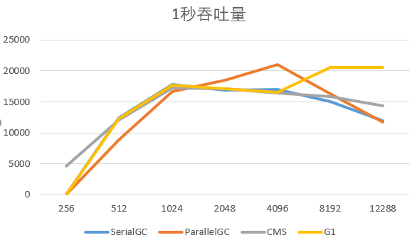
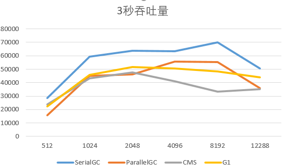

# Week02 作业题目（周三）
## 1. GCLogAnalysis演练

1. 1秒吞吐量测试观察
	1. -XX:-UseAdaptiveSizePolicy参数未见什么影响
	2. Xms设置和Xmx一样大, 可以显著减少young GC次数, 因为少了逐渐扩容的过程
	3. 小内存时(256M), 只有CMS没有OOM
	4. 大内存时(>8G), G1有更好的吞吐量
2. 3秒吞吐量测试观察
	1. 吞吐量为 SerialGC > ParallelGC = G1 > CMS
	2. 内存增大后, 不同gc的垃圾回收次数变化不同.
		1. SerialGC和ParallelGC的gc次数明显减少, 12G内存时, 3秒总共gc了3-4次. 可能逻辑是内存满了才会清理.
		2. CMS和G1的gc次数降到5-6次/秒以后就不再下降了. 可能逻辑是内存不满也会定时清理.
	3. CMS的gc日志行数比SerialGC和ParallelGC高出1个数量级, G1的gc日志行数比SerialGC和ParallelGC高出2个数量级