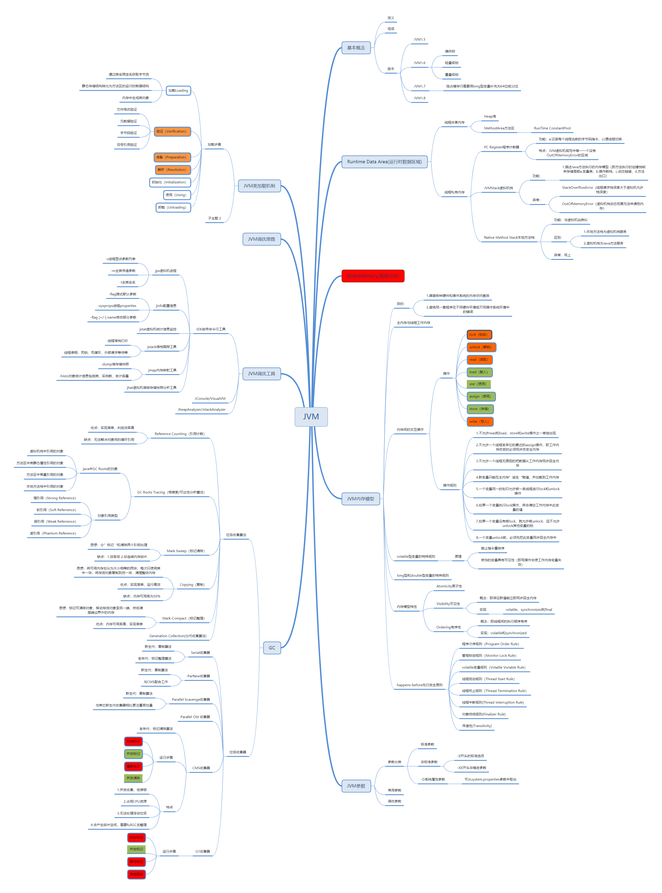
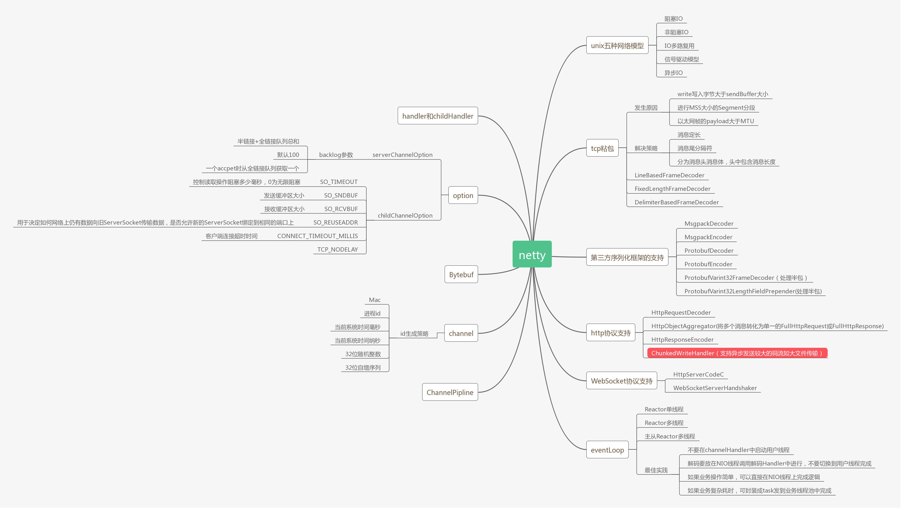
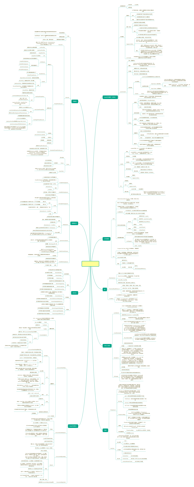
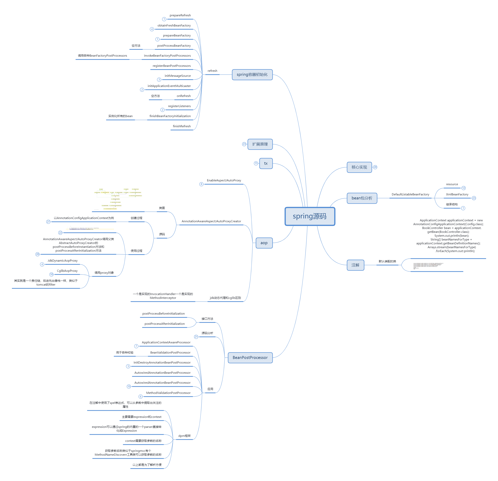
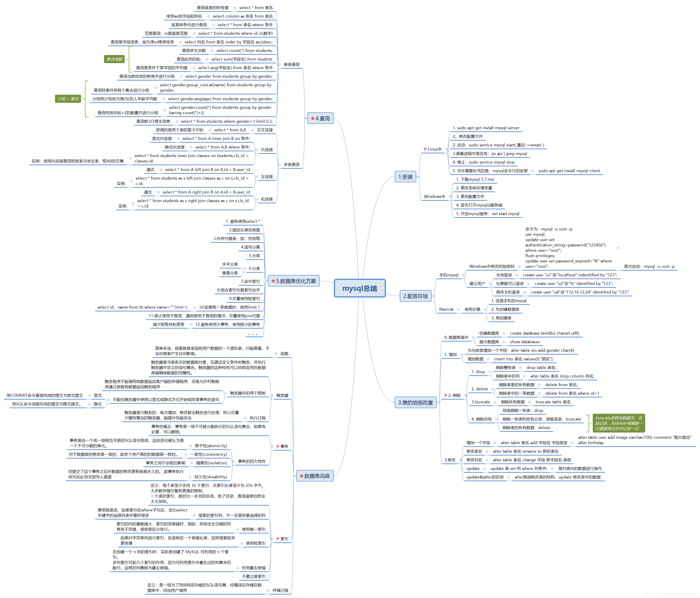
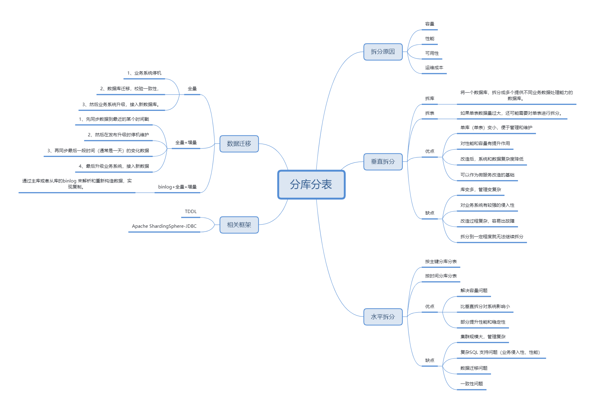
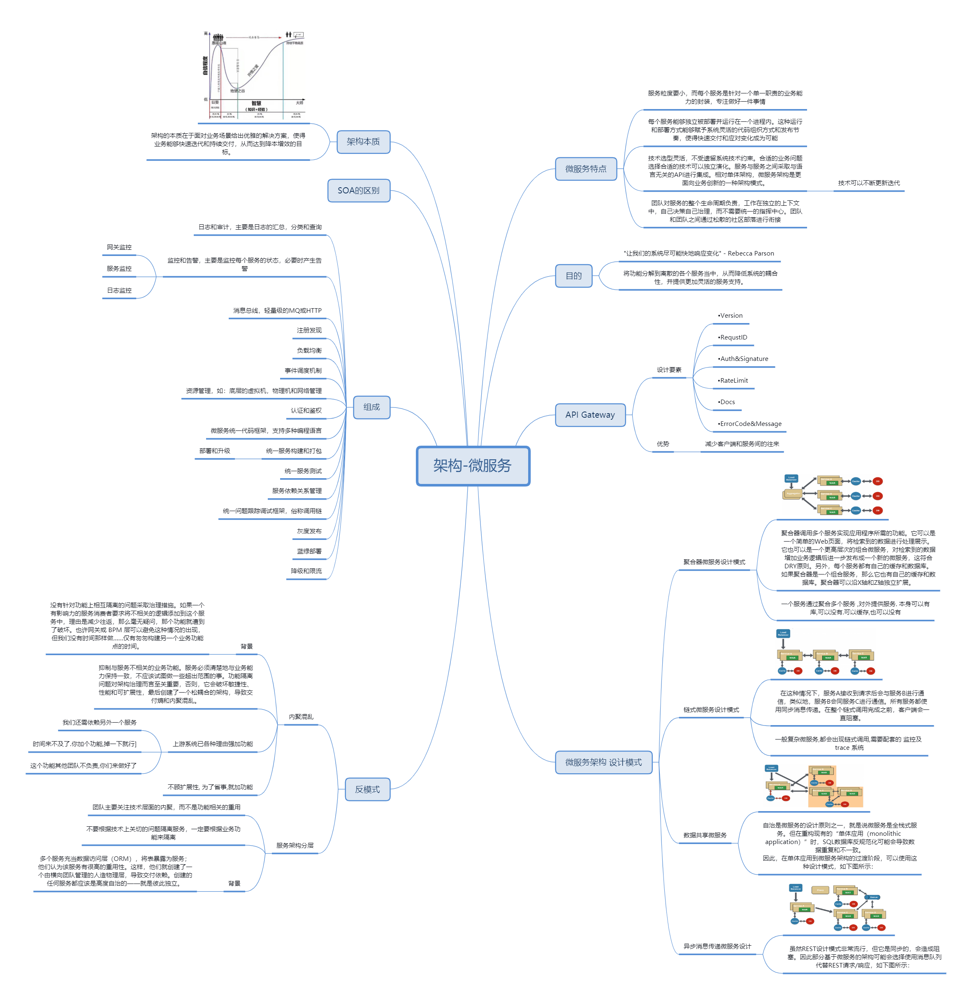
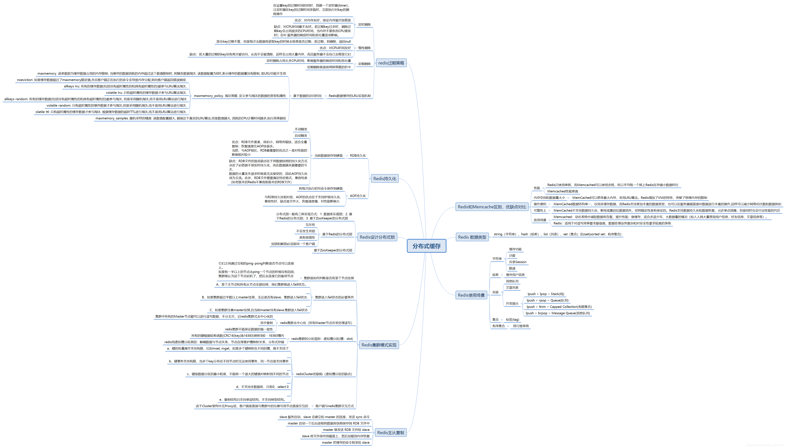
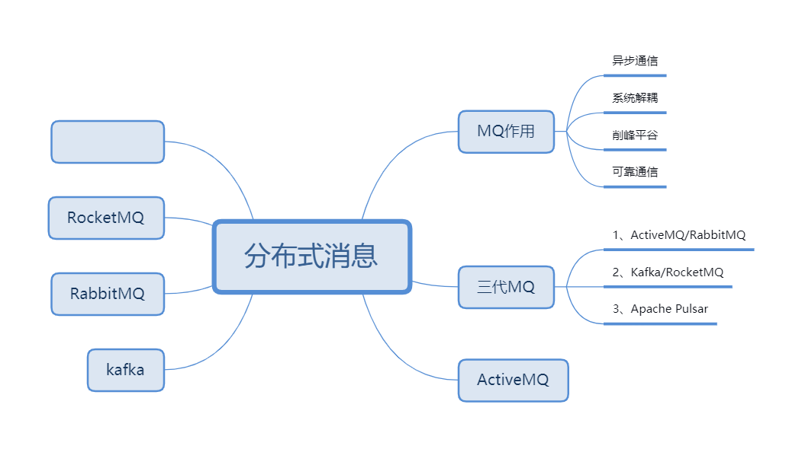

用 100 个字以上的一段话，加上一幅图 (架构图或脑图)，总结自己对下列技术的关键点思考和经验认识:

### 1)JVM

Java Virtual Machine，将程序员编写的代码编译为字节码文件，封装兼容了各个平台，做到一次编译到处运行。并将复杂的内存管理，线程管理的细节进行封装。
1. 类加载器：将符合JVM规范的文件加载、链接（验证、准备、解析）、初始化
2. JVM内存模型：堆 栈 非堆 堆外 JVM自身
3. GC 垃圾回收算法：Serial/ParNew/CMS/G1/ZGC
4. jvm调优：jvm提供了一系列参数，在压测前提下设置系统最适合的值。
5. jvm运行分析：jmap/jstack/jconsole/jps/jinfo/jmc

### 2)NIO

非阻塞IO，解决了传统IO模型，CPU阻塞等待IO处理完成导致的资源浪费。

NIO系统的核心在于：通道(Channel)和缓冲区(Buffer)。通道表示打开到IO 设备(例如：文件、套接字)的连接。若需要使用NIO 系统，需要获取用于连接IO 设备的通道以及用于容纳数据的缓冲区。然后操作缓冲区，对数据进行处理。总而言之，Chennel负责传输，Buffer负责存储。

1. IO模型：同步阻塞、同步非阻塞、异步阻塞、异步非阻塞。
2. netty：基于NIO的网络通信框架。并发高、传输快、封装好。

### 3) 并发编程

摩尔定律失效，单核性能达到瓶颈。并发是一种能并行运行多个程序或并行运行一个程序中多个部分的能力。如果程序中一个耗时的任务能以异步或并行的方式运行，那么整个程序的吞吐量和可交互性将大大改善。现代的PC都有多个CPU或一个CPU中有多个核。是否能合理运用多核的能力将成为一个大规模应用程序的关键。

1. 进程与线程区别
2. 线程安全、线程间通信
3. JUC工具类，降低并发使用难度
4. 线程池，池化宝贵资源，重复利用。

### 

### 4)Spring 和 ORM 等框架

业务开发事实标准
1. bean生命周期管理，依赖注入、IOC、AOP

2. starter的设计开发

3. ORM框架简化数据库操作

   Spring Core：框架的最基础部分，提供 IoC 容器，对 bean 进行管理。它主要的组件就是BeanFactory, 是工厂模式的实现。同时BeanFactory适用控制反转（IOC）思想将应用程序的配置和依赖性规范与实际的应用程序分开。Spring Context：继承BeanFactory，提供上下文信息，扩展出JNDI、EJB、电子邮件、国际化等功能。Spring DAO：提供了JDBC的抽象层，还提供了声明性事务管理方法。并且极大地降低了需要编写地异常代码数据 （例如打开和关闭连接）。Spring ORM：提供了JPA、JDO、Hibernate、MyBatis 等ORM映射层.Spring AOP：集成了所有AOP功能。减弱代码的功能耦合，清晰的被分离开。Spring Web：提供了基础的 Web 开发的上下文信息，现有的Web框架，如JSF、Tapestry、Structs等，提供了集成Spring Web MVC：提供了 Web 应用的 Model-View-Controller 全功能实现。

### 

### 5)MySQL 数据库和 SQL

关系型数据库中的一种，使用关系表存储数据。
1. mysql服务的组成，服务端与客户端。
2. mysql的日志，bin log/redo log/undo log
3. 事务，隔离级别，MVCC，锁
4. 表索引/表锁
5. 结构化查询语言包含6 个部分：
   1）、数据查询语言（DQL: Data Query Language）：其语句，也称为“数据检索语句”，用以从表中获得数据，确定数据怎样在应用程序给出。保留字SELECT 是DQL（也是所有SQL）用得最多的动词，其他DQL 常用的保留字有WHERE，ORDER BYGROUP BY 和HAVING。这些DQL 保留字常与其它类型的SQL 语句一起使用。
   2）、数据操作语言（DML：Data Manipulation Language）：其语句包括动词INSERT、UPDATE 和DELETE。它们分别用于添加、修改和删除。
   3）、事务控制语言（TCL）：它的语句能确保被DML 语句影响的表的所有行及时得以更新。包括COMMIT（提交）命令、SAVEPOINT（保存点）命令、ROLLBACK（回滚）命令。
   4）、数据控制语言（DCL）：它的语句通过GRANT 或REVOKE 实现权限控制，确定单个用户和用户组对数据库对象的访问。某些RDBMS 可用GRANT 或REVOKE 控制对表单个列的访问。
   5）、数据定义语言（DDL）：其语句包括动词CREATE,ALTER 和DROP。在数据库中创建新表或修改、删除表（CREAT TABLE 或DROP TABLE）；为表加入索引等。
   6）、指针控制语言（CCL）：它的语句，像DECLARE CURSOR，FETCH INTO 和UPDATE WHERECURRENT 用于对一个或多个表单独行的操作。

### 6) 分库分表

根据不同的数据库瓶颈，将表分散在不同的数据库或将大表拆分。
1. 如果数据库瓶颈在IO读写，分库更好；如果是表太大导致CRUD速度过慢，可以考虑分表
2. 根据业务模块分库
3. ShardingSphere分布式数据库解决方案
4. 分布式事务，TCC/XA/AT

### 7)RPC 和微服务

RPC是分布式系统的两大基石之一，就是“像调用本地方法一样调用远程方法”。核心是代理机制，原理：1.本地代理存根: Stub；2.本地序列化反序列化；3.网络通信；4.远程序列化反序列化；5.远程服务存根: Skeleton；6.调用实际业务服务；7.原路返回服务结果；8.返回给本地调用方

微服务发展：响应式微服务-服务网格与云原生-数据库网格-单元化架构

微服务应用在复杂度低的情况下，生产力比单体架构低；在复杂度高的地方，情况恰恰相反，随着复杂度升高，单体架构的生产力快速下降，而微服务相对平稳

### 8) 分布式缓存

缓存穿透：大量并发查询不存在的KEY，导致都直接将压力透传到数据库。

解决：

1、缓存空值的KEY，这样第一次不存在也会被加载会记录，下次拿到有这个KEY。
2、Bloom过滤或RoaringBitmap 判断KEY是否存在。
3、完全以缓存为准，使用延迟异步加载的策略2，这样就不会触发更新。

缓存击穿：某个KEY失效的时候，正好有大量并发请求访问这个KEY。

解决：

1、KEY的更新操作添加全局互斥锁。
2、完全以缓存为准，使用延迟异步加载的策略，这样就不会触发更新。

缓存雪崩：当某一时刻发生大规模的缓存失效的情况，会有大量的请求进来直接打到数据库，导致数据
库压力过大升值宕机。
分析：一般来说，由于更新策略、或者数据热点、缓存服务宕机等原因，可能会导致缓存数据同一
个时间点大规模不可用，或者都更新。所以，需要我们的更新策略要在时间上合适，数据要均匀分
散，缓存服务器要多台高可用。
解决办法：
1、更新策略在时间上做到比较均匀。
2、使用的热数据尽量分散到不同的机器上。
3、多台机器做主从复制或者多副本，实现高可用。
4、实现熔断限流机制，对系统进行负载能力控制。

Redis使用

1、性能：
1) 线程数与连接数；
2) 监控系统读写比和缓存命中率；
2、容量：
1) 做好容量评估，合理使用缓存资源；
3、资源管理和分配：
1) 尽量每个业务集群单独使用自己的Redis，不混用；
2) 控制Redis资源的申请与使用，规范环境和Key的管理（以一线互联网为例）；
3) 监控CPU 100%，优化高延迟的操作。

### 9) 分布式消息队列

通过发送消息实现线程/进程间通信

1. 第一代 ActiveMq、RabbitMq；第二代 kafka、RocketMq；第三代 Pulsar
2. MQ的四大作用
   - 异步通信：异步通信，减少线程等待，特别是处理批量等大事务、耗时操作。
   - 系统解耦：系统不直接调用，降低依赖，特别是不在线也能保持通信最终完成。
   - 削峰平谷：压力大的时候，缓冲部分请求消息，类似于背压处理。
   - 可靠通信：提供多种消息模式、服务质量、顺序保障等。
3. 消息模式：Pub-Sub、点对点
4. 开发简易消息队列

 

